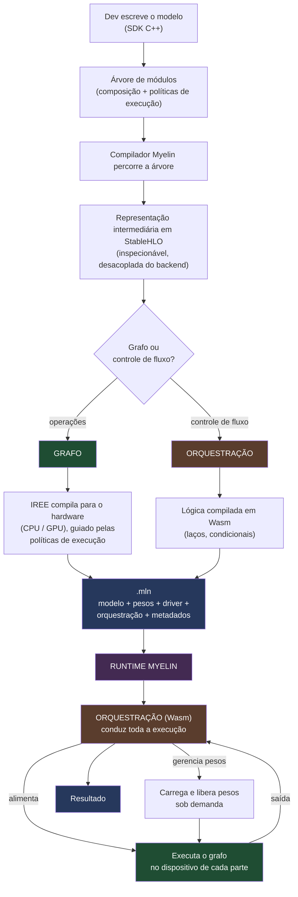

Myelin é um framework de **inferência** (não treino). Em vez de exportar um modelo treinado por um caminho automático e frágil, o dev **reescreve o modelo** no SDK Myelin.

Esse modelo é compilado para rodar em múltiplos backends, de acordo com as configurações de compilação e a disponibilidade do backend selecionado, e empacotado num único arquivo (`.mln`) que carrega o modelo, os pesos, o driver do backend e a orquestração necessária para executá-lo — sem depender de um runtime que reimplemente a arquitetura.

Por baixo, assenta sobre o **IREE**: as operações do modelo são compiladas por ele para o hardware alvo, enquanto a lógica é compilada em **Wasm**. O Myelin cuida da execução em runtime e do empacotamento.

---

## Como funciona

### Autoria

O desenvolvedor descreve o modelo como uma árvore de módulos que se compõem, cada um com sua própria lógica de `forward`. Operações prontas e operações definidas pelo desenvolvedor usam a mesma interface.

A partir do algoritmo construído com o SDK, o compilador Myelin monta primeiro uma representação intermediária do modelo, representando seu código inteiramente com StableHLO. Assim o algoritmo fica desacoplado das políticas de execução e pode ser inspecionado antes de qualquer compilação.

### Grafo e orquestração

O Myelin separa o modelo em duas naturezas:

- O **grafo** — as operações determinísticas do modelo. É o que vira StableHLO, compilado e otimizado para o hardware.
- A **orquestração** — o controle de fluxo: laços, condicionais e decisões tomadas durante a execução. Não é matemática; é a coordenação de quando e como rodar cada parte.

Um laço de geração, um `if` que depende da entrada — tudo isso é orquestração, e o Myelin a trata separadamente das operações pesadas. Isso permite compilar a parte determinística de forma agressiva, sem abrir mão de comportamentos dinâmicos.

### Políticas de execução

Cada parte do modelo pode declarar como quer ser executada:

- **Backend**: em qual dispositivo roda (uma CPU, uma GPU específica, ou vários ao mesmo tempo);
- **Quantização**: o formato de quantização dos pesos;
- **Volatilidade**: se os pesos são carregados sob demanda e liberados quando ociosos.

Essa configuração é **herdada**: você declara só o que difere numa parte, e o resto propaga a partir do que está acima na árvore do modelo. Assim, partes diferentes do mesmo modelo podem rodar em dispositivos diferentes, com formatos de peso diferentes, sem que você repita configuração.

### Quantização

O Myelin expressa a dequantização como parte do próprio grafo do modelo, montada de forma que seja executada junto à operação que usa os pesos. Os formatos de compressão são extensíveis: o desenvolvedor pode descrever sua própria dequantização e explicitá-la nas políticas de execução. Também pode ser expressada a operação de quantização necessária para a compilação do modelo.

---

## O artefato `.mln`

O produto final é um pacote único e autossuficiente, contendo:

- o **modelo compilado**, com cada parte acessível pelo seu lugar na árvore;
- os **pesos**, num formato próprio do Myelin, organizados de forma que partes possam ser carregadas e liberadas sob demanda;
- a **orquestração**, que coordena a execução;
- os **metadados** que dizem ao runtime como executar cada parte.

Tudo num só lugar, sem configuração externa. Um runtime Myelin carrega o `.mln` e executa o modelo seguindo a política de execução e a lógica do modelo. A orquestração escrita pelo desenvolvedor decide quais funções do grafo usar e quando, dando liberdade para representar modelos dos mais básicos aos mais complexos.

### Pipeline dos pesos

Os pesos não entram crus no artefato. Uma ferramenta de conversão parte do **safetensors**, aplica a **quantização** definida na configuração (quando houver), e emite o **formato de pesos do Myelin** — pronto para carga eficiente e organizado para que cada parte do modelo tenha seus pesos carregados e descarregados de forma independente.

```
safetensors  →  [quantização, se houver]  →  formato Myelin
```

---

## Ciclo completo: do SDK ao runtime



---

## Estado atual

O pipeline foi validado de ponta a ponta com o **YOLO26**, reescrito no SDK, compilado, executado com os pesos reais e produzindo a saída correta.

**To-do:** 
- [ ] Refinar a interface de quantização.
- [ ] Integração do runtime Wasm com acesso a símbolos nativos customizados por API.
- [ ] Execução distribuída entre múltiplos dispositivos.
